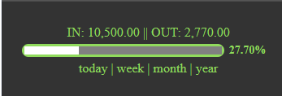
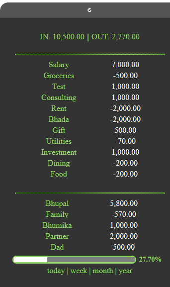
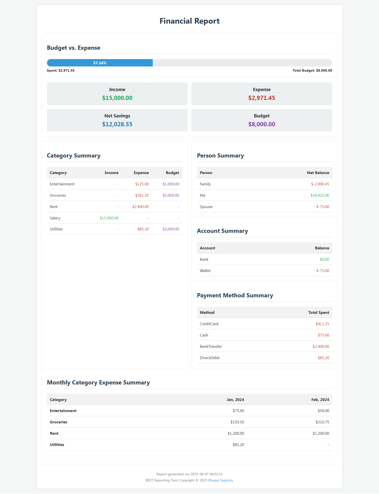

## **BEXT parser in PHP**

### **Overview**

PHP Parser for [Budgeting and Expense Tracking (bext)](https://github.com/bhu1st/bext) File Format Specification

### **Uses example**


```
php bext.php sample.bext "<filter>"
```

---


### Filter Syntax

| Symbol | Meaning           | Example              |
| ------ | ----------------- | -------------------- |
| `@`    | Person            | `@Bhupal`            |
| `#`    | Category (or sub) | `#Groceries>Veggies` |
| `~`    | Account (or sub)  | `~PersonalAccount`       |
| `:`    | Payment Method    | `:qr`                |


---

### Supported Date Modifiers

| Modifier | Meaning      |
| -------- | ------------ |
| `d`      | Today        |
| `-d`     | Yesterday    |
| `w`      | This Week    |
| `-w`     | Last Week    |
| `m`      | This Month   |
| `-m`     | Last Month   |
| `y`      | This Year    |
| `-y`     | Last Year    |
| `q`      | This Quarter |
| `-q`     | Last Quarter |


---

### Examples

```
php bext.php sample.bext
```

Output:

```
{
    "income": 10500,
    "expense": 2770,
    "category": {
        "Salary": 7000,
        "Test": 1000,
        "Consulting": 1000,
        "Gift": 500,
        "Investment": 1000,
        "Groceries": -500,
        "Rent": -2000,
        "Bhada": -2000,
        "Utilities": -70,
        "Dining": -200,
        "Food": -200
    },
    "person": {
        "Bhupal": 5800,
        "Bhumika": 1000,
        "Partner": 2000,
        "Dad": 500,
        "Family": -570
    },
    "account": {
        "Bank": 7000,
        "Other": 1000,
        "Wallet": 0,
        "Cash": -270
    },
    "method": {
        "cash": 6730,
        "qr": 1500,
        "wallet": 1000,
        "bank": 1000,
        "card": -2500
    },
    "budget": {
        "total": 10000,
        "account": {
            "Bank": 10000
        },
        "person": [],
        "category": []
    }
}

```

```
php bext.php sample.bext "~Bank"
```
Output:

```
{
    "filter": "~Bank",
    "transactions": [
        {
            "budget": 10000,
            "categories": [],
            "accounts": [
                "Bank"
            ],
            "persons": [],
            "method": "bank",
            "remarks": "Initial deposit"
        },
        {
            "type": "+",
            "amount": 7000,
            "persons": [
                "Bhupal"
            ],
            "categories": [
                "Salary"
            ],
            "timestamp": "12\/01\/2024 10:00",
            "accounts": [
                "Bank"
            ],
            "remarks": "Monthly salary deposit",
            "method": "cash"
        },
        {
            "type": "+",
            "amount": 1000,
            "persons": [
                "Bhupal",
                "Bhumika"
            ],
            "categories": [
                "Test"
            ],
            "timestamp": "12\/01\/2024 10:00",
            "accounts": [
                "Bank"
            ],
            "remarks": "Multiple persons and account specified",
            "method": "qr"
        },
        {
            "type": "+",
            "amount": 1000,
            "persons": [
                "Partner"
            ],
            "categories": [
                "Investment"
            ],
            "timestamp": "12\/05\/2024 15:00",
            "accounts": [
                "Bank"
            ],
            "remarks": "Stock market investment",
            "method": "bank"
        },
        {
            "type": "-",
            "amount": 2000,
            "persons": [
                "Bhupal"
            ],
            "categories": [
                "Rent",
                "Bhada"
            ],
            "timestamp": null,
            "accounts": [
                "Bank"
            ],
            "remarks": "December rent payment",
            "method": "card"
        }
    ],
    "total_budget": 10000,
    "total_income": 9000,
    "total_expense": 2000
}

```


```
php bext.php sample.bext "@Bhumika"
```
Output:

```
{
    "filter": "@Bhumika",
    "transactions": [
        {
            "type": "+",
            "amount": 1000,
            "persons": [
                "Bhupal",
                "Bhumika"
            ],
            "categories": [
                "Test"
            ],
            "timestamp": "12\/01\/2024 10:00",
            "accounts": [
                "Bank"
            ],
            "remarks": "Multiple persons and account specified",
            "method": "qr"
        }
    ],
    "total_budget": 0,
    "total_income": 1000,
    "total_expense": 0
}

```

```
php bext.php sample.bext "#Gift"
```
Output:

```
{
    "filter": "#Gift",
    "transactions": [
        {
            "type": "+",
            "amount": 500,
            "persons": [
                "Dad"
            ],
            "categories": [
                "Gift"
            ],
            "timestamp": null,
            "accounts": [
                "Wallet"
            ],
            "remarks": "Birthday gift for Partner",
            "method": "qr"
        }
    ],
    "total_budget": 0,
    "total_income": 500,
    "total_expense": 0
}

```

List all transactions of this month

```
php bext.php sample.bext m
```

List all transactions of last month

```
php bext.php sample.bext -m
```

Similarly d (today), -d (yesterday), w (this week),  -w (last week), m (current month), -m (last month), y (current year), and -y (last year) can be used to get transactions and totals on the respective date range.

Combined filters

```
php bext.php sample.bext "#Food :cash"
```


### BEXT-bar Example

You can use the JSON output to display a BEXT-bar which shows a progress bar of expense vs. budget.



### Income Expense Dashboard

The JSON output can be displayed as shown in the image to list out the summary of transactions by categories and persons.




### BEXT Report 

You can generate Financial report of your BEXT records using `report.php` file by changing the BEXT file location and currency placeholder. Below report is generated using records from `data.bext` file.



